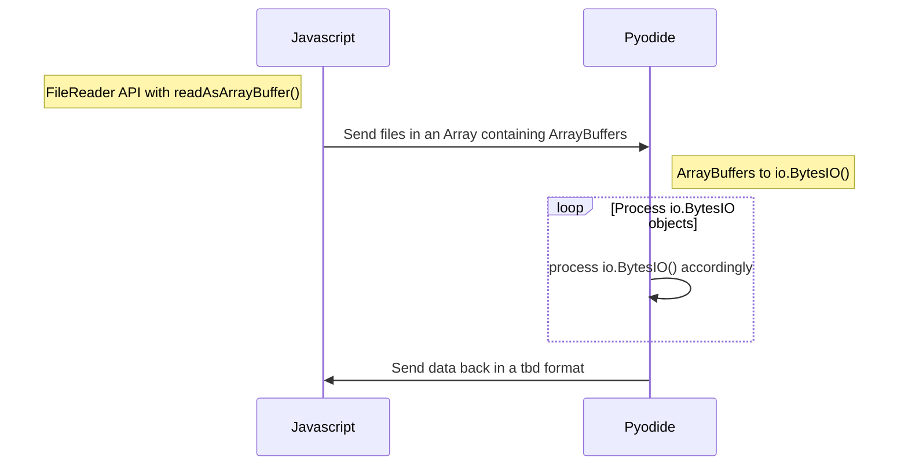

# Minimal Pyodide testing code

Code for experimentation and prototyping. Mainly to see how a objects from javascript can be passed to Pyodide. The idea is is that files from DDP will be very diverse, and won't only be zipfiles. Therefore, any object/multiple objects need to be able to be passed to Pyodide. 

The idea is the following:



### Thoughts

1. I kind of like this approach Pyodide will always receive the exact same objects. Its nice and uniform.
I think what needs to be added is, MIME type information needs to be passed along. So Pyodide does not have to guess what kind of file its dealing with.
2. You can use this code to experiment with loading Pyodide packages: look in `worker.js` 
3. Full folder uploads by drag and dropping/input field by using [HTMLInputElement.webkitdirectory](https://developer.mozilla.org/en-US/docs/Web/API/HTMLInputElement/webkitdirectory) is not (yet) included here.


### Usage

All code is in `index.html` for convenience except the pyodide API and the worker.

Host with:

```
python3 -m http.server 8000 --bind localhost
```
