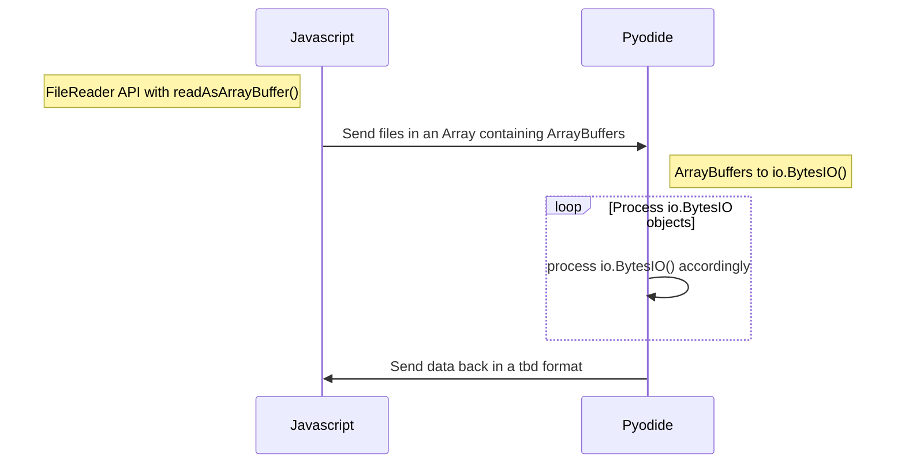

# Minimal Pyodide testing code

This code can be used for experimentation and for prototyping DDP parsing development.
You can use this code to experiment with loading Pyodide packages: check `worker.js` 

It works as follows:



### Usage

All code is in `index.html` for convenience except the pyodide API and the worker.

Host with:

```
python3 -m http.server 8000 --bind localhost
```
